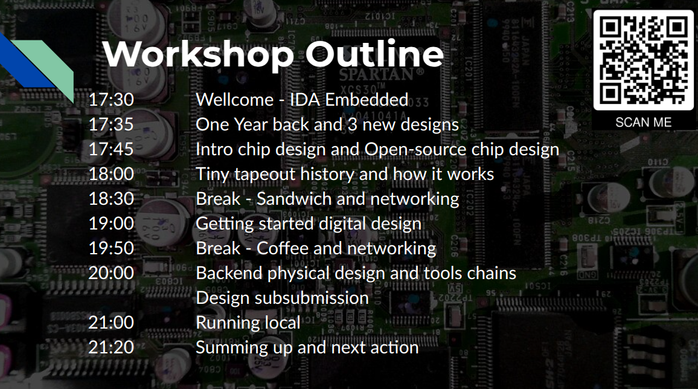

# Introduction to open source chip design and Tiny Tapeout

 Aarhus Universitet d.1/4, 17.30-21.30, rum 5125-140
 
---

* Dette repository indeholder Kodeeksempel og testbenches, kode til design og test ligger dels under /src og /test

Herunder et link til github repository med original koden

[Github repository til original kode](https://github.com/Gurusatwik/PWM-Generator)

## Mine slides til workshop i Aarhus
[Slides til workshop](https://1drv.ms/p/s!AlPHw4nTEbc6pfRCYrTPNJEeWBVsMQ?e=jDJ7dZ)

---

## Program over workshop i København

---
[Github repository tiltilrettet Tiny tapeout repository](https://github.com/jmkr-ece-git/au-tt-workshop-jmkr.git)
